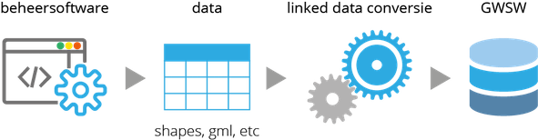

## Welkom

Behoefte aan een dataset die conform het [GWSW](https://data.gwsw.nl/){:target="_blank" rel="noopener"} is opgebouwd?

Onze conversietool maakt dat mogelijk en heeft zich voor diverse waterschappen en gemeenten bewezen.

Ontworpen en gebouwd door __Wouter van Riel__ ([infralytics](https://www.infralytics.org){:target="_blank" rel="noopener"}) en __Marco van Bijnen__ ([Duopp B.V.](https://duopp.nl){:target="_blank" rel="noopener"})

## Hoe werkt het?

Er wordt gewerkt met een export uit de gebruikte beheersoftware. Meestal is deze export in een geo-formaat, zoals shape, gml, geodatabase of geojson.

De conversietool is gebouwd met de gedachte om volledig 'beheerpakket-onafhankelijk' te werk te gaan. 

1. Ontvangst data in 'geo-formaat' (shape, gml, geojson, etc.)
2. Mapping: koppeling van parameters in de data aan het GWSW
3. Conversie: omzetten van ruwe data in GWSW formaat (OROX / .ttl)
4. Upload: geconverteerde dataset uploaden naar GWSW-server
5. Publicatie: publicatie  van dataset op [PDOK](https://www.pdok.nl/viewer/){:target="_blank" rel="noopener"}, waarmee dataset openbaar beschikbaar is

## Interesse?

Vragen of meer informatie nodig?

Neem contact op met Wouter van Riel via [wouter.van.riel@infralytics.org](mailto:wouter.van.riel@infralytics.org) of Marco van Bijnen via [marco@mvbijnenadvies.nl](mailto:marco@mvbijnenadvies.nl)
