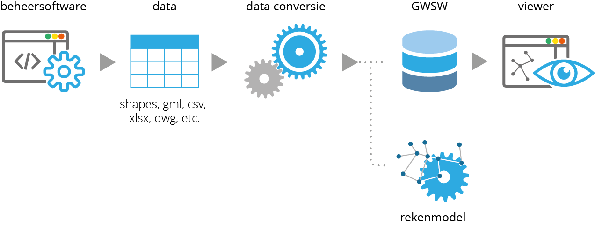

## Welkom

Behoefte aan een dataset die conform het [GWSW](https://data.gwsw.nl/){:target="_blank" rel="noopener"} is opgebouwd?

Onze conversietool maakt dat mogelijk en heeft zich voor diverse waterschappen en gemeenten bewezen.

Ontworpen en gebouwd door __Wouter van Riel__ ([infralytics](https://www.infralytics.org){:target="_blank" rel="noopener"}) en __Marco van Bijnen__ ([Duopp B.V.](https://duopp.nl){:target="_blank" rel="noopener"})

## Hoe werkt het?

 

1. Er wordt gewerkt met een export uit de gebruikte beheersoftware. Meestal is deze export in een geo-formaat, zoals shape, gml, geodatabase of geojson. 

2. De parameters in de dataset worden gekoppeld aan GWSW-parameters. Dit proces heet 'mapping'.

3. De conversietool zet de dataset om in het GWSW-formaat (OROX / .ttl)

4. De geconverteerde dataset wordt geüpload op de GWSW-server

5. Optioneel: de geconverteerde dataset wordt gepubliceerd op [PDOK](https://www.pdok.nl/viewer/){:target="_blank" rel="noopener"}, waardoor de dataset openbaar beschikbaar is

## Voordelen
De conversietool is gebouwd met de gedachte om volledig 'beheersoftware-onafhankelijk' te werk te gaan. Vanuit nagenoeg ieder geoformaat is een conversie mogeijk.

De mapping is volledig zelf aan te passen naar wens. We hebben hierdoor de volledige vrijheid om, mits gedefinieerd door het GWSW, parameters en waarden aan te passen en/of toe te voegen.

Er is de mogelijkheid om de geconverteerde dataset in meer formaten op te slaan dan enkel in OROX / .ttl.

## Interesse?

Vragen of meer informatie nodig?

Neem contact op met Wouter van Riel via [wouter.van.riel@infralytics.org](mailto:wouter.van.riel@infralytics.org) of Marco van Bijnen via [marco@mvbijnenadvies.nl](mailto:marco@mvbijnenadvies.nl)
